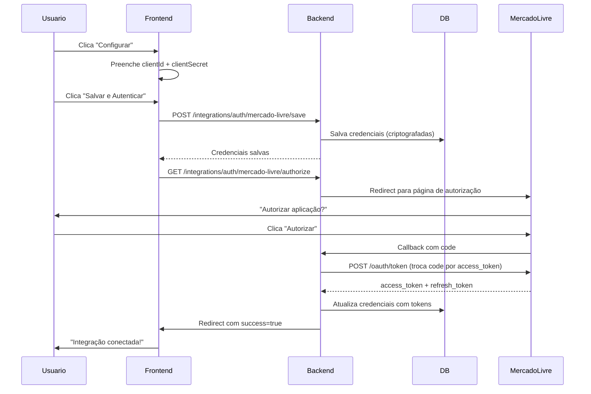
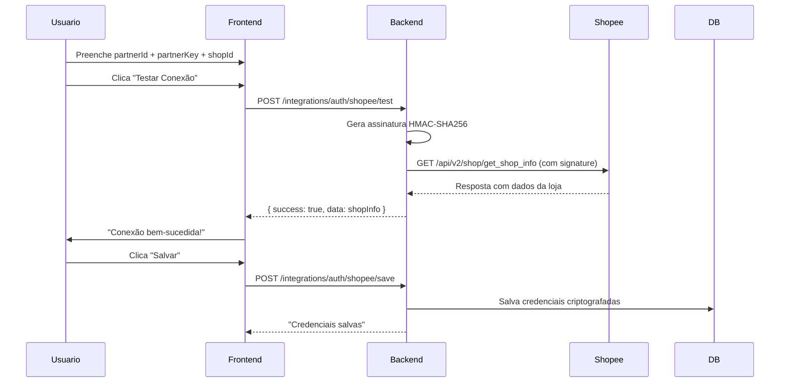
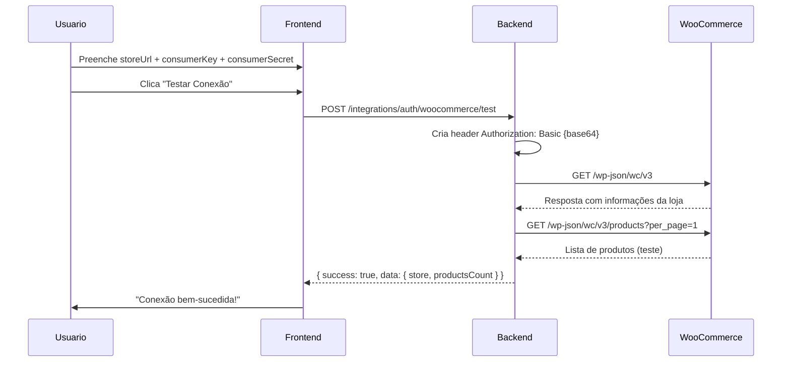
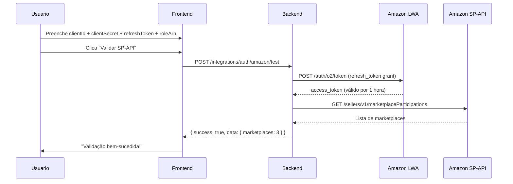

# 🎯 ETAPA 06 COMPLETA

## Configuração e Autenticação Real dos Marketplaces

**Status:** ✅ 100% Implementado  
**Data:** 10/11/2025  
**Versão:** 1.0.0

---

## 📋 Resumo Executivo

A Etapa 06 implementa **autenticação real** com os 4 marketplaces principais:
- **Mercado Livre** (OAuth2)
- **Shopee** (HMAC Signature)
- **WooCommerce** (Basic Auth)
- **Amazon SP-API** (LWA + AWS SigV4)

**Não há sincronização de produtos ainda** — isso será a Etapa 07.
Esta etapa foca exclusivamente em:
- ✅ Configuração de credenciais
- ✅ Autenticação e autorização
- ✅ Testes de conexão
- ✅ Salvamento seguro (criptografado)
- ✅ Sistema de webhooks (registro apenas)

---

## 🏗️ Arquitetura Implementada

### Backend (NestJS)

```
backend/src/modules/integrations/
├── dto/
│   └── auth.dto.ts                    # DTOs para autenticação
├── services/
│   └── auth.service.ts                # 4 serviços de autenticação
├── controllers/
│   └── integrations-auth.controller.ts # Endpoints de auth
├── encryption.service.ts              # Criptografia AES-256
└── integrations.module.ts             # Módulo atualizado
```

### Frontend (Next.js)

```
frontend/app/integracoes/
└── [marketplace]/
    └── configuracao/
        └── page.tsx                   # Formulário de configuração
```

---

## 🔐 1. MERCADO LIVRE (OAuth2)

### Credenciais Necessárias

| Campo | Descrição | Obrigatório |
|-------|-----------|-------------|
| `clientId` | Client ID da aplicação ML | ✅ |
| `clientSecret` | Client Secret da aplicação ML | ✅ |
| `redirectUri` | URL de callback (auto-preenchida) | ⚠️ Somente leitura |

### Fluxo de Autenticação



### Endpoints

#### 1. Salvar Credenciais
```http
POST /integrations/auth/mercado-livre/save
Authorization: Bearer {jwt_token}
Content-Type: application/json

{
  "clientId": "1234567890",
  "clientSecret": "AbCdEfGhIjKlMnOp",
  "redirectUri": "http://localhost:4000/integrations/auth/mercado-livre/callback"
}
```

**Resposta:**
```json
{
  "success": true,
  "message": "Credenciais salvas com sucesso"
}
```

#### 2. Iniciar OAuth2
```http
GET /integrations/auth/mercado-livre/authorize?client_id=1234567890
Authorization: Bearer {jwt_token}
```

**Resposta:** Redirect 302 para Mercado Livre

#### 3. Callback OAuth2
```http
GET /integrations/auth/mercado-livre/callback?code=TG-abc123&state=userId:timestamp
```

**Fluxo interno:**
1. Extrai `userId` do `state`
2. Busca credenciais salvas no DB
3. Troca `code` por `access_token` via API ML
4. Salva tokens criptografados
5. Redirect para frontend com `success=true`

#### 4. Testar Conexão
```http
POST /integrations/auth/mercado-livre/test
Authorization: Bearer {jwt_token}
Content-Type: application/json

{
  "clientId": "1234567890",
  "clientSecret": "AbCdEfGhIjKlMnOp"
}
```

**Resposta:**
```json
{
  "success": true,
  "message": "Credenciais válidas. Fluxo OAuth2 pode ser iniciado.",
  "data": {
    "authUrl": "https://auth.mercadolivre.com.br/authorization?...",
    "clientId": "1234567890"
  },
  "timestamp": "2025-11-10T17:00:00.000Z",
  "responseTime": 145
}
```

### Renovação de Token

O `refresh_token` é salvo no banco. Para renovar:

```typescript
// Backend automático (quando access_token expira)
const tokenResponse = await mercadoLivreAuthService.refreshAccessToken(
  storedRefreshToken,
  clientId,
  clientSecret
);
```

### Validação de Token

```typescript
// Valida se access_token está ativo
const userInfo = await mercadoLivreAuthService.validateToken(accessToken);
// Retorna: { id, nickname, email, ... }
```

---

## 🛍️ 2. SHOPEE (HMAC Signature)

### Credenciais Necessárias

| Campo | Descrição | Obrigatório |
|-------|-----------|-------------|
| `partnerId` | Partner ID da Shopee Open Platform | ✅ |
| `partnerKey` | Partner Key (usado para assinatura) | ✅ |
| `shopId` | ID da loja na Shopee | ✅ |

### Fluxo de Autenticação



### Assinatura HMAC

**Formato:**
```
baseString = partnerId + path + timestamp
signature = HMAC-SHA256(baseString, partnerKey)
```

**Exemplo:**
```typescript
partnerId: "123456"
path: "/api/v2/shop/get_shop_info"
timestamp: 1699632000
partnerKey: "abcdef123456"

baseString = "123456/api/v2/shop/get_shop_info1699632000"
signature = hmac_sha256(baseString, "abcdef123456")
// Resultado: "f7d8a9b6c5e4d3a2b1c0..."
```

### Endpoints

#### 1. Testar Conexão
```http
POST /integrations/auth/shopee/test
Authorization: Bearer {jwt_token}
Content-Type: application/json

{
  "partnerId": "123456",
  "partnerKey": "abcdef123456",
  "shopId": "789012"
}
```

**Resposta:**
```json
{
  "success": true,
  "message": "Conexão bem-sucedida com Shopee",
  "data": {
    "shop_id": 789012,
    "shop_name": "Minha Loja",
    "region": "BR",
    "status": "NORMAL"
  },
  "timestamp": "2025-11-10T17:00:00.000Z",
  "responseTime": 320
}
```

#### 2. Gerar Assinatura de Teste
```http
POST /integrations/auth/shopee/generate-signature
Authorization: Bearer {jwt_token}
Content-Type: application/json

{
  "partnerId": "123456",
  "partnerKey": "abcdef123456",
  "shopId": "789012"
}
```

**Resposta:**
```json
{
  "signature": "f7d8a9b6c5e4d3a2b1c0...",
  "timestamp": 1699632000,
  "path": "/api/v2/shop/get_shop_info",
  "partnerId": "123456"
}
```

#### 3. Salvar Credenciais
```http
POST /integrations/auth/shopee/save
Authorization: Bearer {jwt_token}
Content-Type: application/json

{
  "partnerId": "123456",
  "partnerKey": "abcdef123456",
  "shopId": "789012"
}
```

---

## 🏪 3. WOOCOMMERCE (Basic Auth)

### Credenciais Necessárias

| Campo | Descrição | Obrigatório |
|-------|-----------|-------------|
| `storeUrl` | URL completa da loja | ✅ |
| `consumerKey` | Consumer Key da REST API | ✅ |
| `consumerSecret` | Consumer Secret da REST API | ✅ |

### Fluxo de Autenticação



### Basic Authentication

**Header gerado:**
```
Authorization: Basic {base64(consumerKey:consumerSecret)}
```

**Exemplo:**
```typescript
consumerKey: "ck_abcd1234efgh5678"
consumerSecret: "cs_ijkl9012mnop3456"

credentials = "ck_abcd1234efgh5678:cs_ijkl9012mnop3456"
base64 = Buffer.from(credentials).toString('base64')
// "Y2tfYWJjZDEyMzRlZmdoNTY3ODpjc19pamtsMTIzNDU2..."

header = "Basic Y2tfYWJjZDEyMzRlZmdoNTY3ODpjc19pamtsMTIzNDU2..."
```

### Endpoints

#### 1. Testar Conexão
```http
POST /integrations/auth/woocommerce/test
Authorization: Bearer {jwt_token}
Content-Type: application/json

{
  "storeUrl": "https://minha-loja.com",
  "consumerKey": "ck_abcd1234efgh5678",
  "consumerSecret": "cs_ijkl9012mnop3456"
}
```

**Resposta:**
```json
{
  "success": true,
  "message": "Conexão bem-sucedida com WooCommerce",
  "data": {
    "store": {
      "version": "8.2.0",
      "name": "Minha Loja",
      "description": "Descrição da loja",
      "url": "https://minha-loja.com",
      "store_email": "contato@minha-loja.com"
    },
    "productsCount": 1
  },
  "timestamp": "2025-11-10T17:00:00.000Z",
  "responseTime": 580
}
```

#### 2. Salvar Credenciais
```http
POST /integrations/auth/woocommerce/save
Authorization: Bearer {jwt_token}
Content-Type: application/json

{
  "storeUrl": "https://minha-loja.com",
  "consumerKey": "ck_abcd1234efgh5678",
  "consumerSecret": "cs_ijkl9012mnop3456"
}
```

---

## 📦 4. AMAZON SP-API (LWA + AWS SigV4)

### Credenciais Necessárias

| Campo | Descrição | Obrigatório |
|-------|-----------|-------------|
| `clientId` | LWA Client ID | ✅ |
| `clientSecret` | LWA Client Secret | ✅ |
| `refreshToken` | Refresh Token obtido da Amazon | ✅ |
| `roleArn` | AWS Role ARN para SP-API | ✅ |
| `sellerId` | Merchant ID / Seller ID | ⚠️ Opcional |

### Fluxo de Autenticação



### Login with Amazon (LWA)

**Token URL:**
```
POST https://api.amazon.com/auth/o2/token
Content-Type: application/x-www-form-urlencoded

grant_type=refresh_token
&refresh_token={refreshToken}
&client_id={clientId}
&client_secret={clientSecret}
```

**Resposta:**
```json
{
  "access_token": "Atza|IwEBIA...",
  "token_type": "bearer",
  "expires_in": 3600
}
```

### Endpoints

#### 1. Testar Conexão
```http
POST /integrations/auth/amazon/test
Authorization: Bearer {jwt_token}
Content-Type: application/json

{
  "clientId": "amzn1.application-oa2-client.abc123",
  "clientSecret": "def456ghi789",
  "refreshToken": "Atzr|IwEBIP...",
  "roleArn": "arn:aws:iam::123456789012:role/SPAPIRole",
  "sellerId": "A1B2C3D4E5F6G7"
}
```

**Resposta:**
```json
{
  "success": true,
  "message": "Conexão bem-sucedida com Amazon SP-API",
  "data": {
    "marketplaces": 3,
    "sellerId": "A1B2C3D4E5F6G7"
  },
  "timestamp": "2025-11-10T17:00:00.000Z",
  "responseTime": 1250
}
```

#### 2. Salvar Credenciais
```http
POST /integrations/auth/amazon/save
Authorization: Bearer {jwt_token}
Content-Type: application/json

{
  "clientId": "amzn1.application-oa2-client.abc123",
  "clientSecret": "def456ghi789",
  "refreshToken": "Atzr|IwEBIP...",
  "roleArn": "arn:aws:iam::123456789012:role/SPAPIRole",
  "sellerId": "A1B2C3D4E5F6G7"
}
```

---

## 🔔 5. SISTEMA DE WEBHOOKS

### Registro de Webhooks

Cada marketplace pode ter webhooks configurados para receber eventos em tempo real.

#### Obter URL de Webhook
```http
GET /integrations/auth/{marketplace}/webhook/url
Authorization: Bearer {jwt_token}
```

**Resposta:**
```json
{
  "webhookUrl": "http://localhost:4000/integrations/webhook/mercado-livre",
  "marketplace": "mercado-livre",
  "instructions": "Configure esta URL no painel do mercado-livre"
}
```

#### Registrar Configuração de Webhook
```http
POST /integrations/auth/{marketplace}/webhook/register
Authorization: Bearer {jwt_token}
Content-Type: application/json

{
  "webhookUrl": "https://meu-dominio.com/webhooks/mercado-livre",
  "webhookSecret": "opcional_secret_customizado"
}
```

**Resposta:**
```json
{
  "webhookUrl": "https://meu-dominio.com/webhooks/mercado-livre",
  "webhookSecret": "f7a9b6c5e4d3a2b1c0...",
  "marketplace": "mercado-livre",
  "status": "registered"
}
```

### URLs de Webhook por Marketplace

| Marketplace | URL |
|-------------|-----|
| Mercado Livre | `/integrations/webhook/mercado-livre` |
| Shopee | `/integrations/webhook/shopee` |
| Amazon | `/integrations/webhook/amazon` |
| WooCommerce | `/integrations/webhook/woocommerce` |

**⚠️ IMPORTANTE:** Os endpoints de webhook **ainda não processam eventos**. Isso será implementado na Etapa 08. Por enquanto, apenas salvamos as configurações.

---

## 🔒 6. SEGURANÇA E CRIPTOGRAFIA

### Criptografia de Credenciais

Todas as credenciais são criptografadas com **AES-256-GCM** antes de serem salvas no banco.

**Formato de armazenamento:**
```
iv:encrypted:authTag (base64)
```

**Exemplo de credencial criptografada:**
```
"a1b2c3d4e5f6g7h8:9i0j1k2l3m4n5o6p:7q8r9s0t1u2v3w4x5y6z"
```

### Variável de Ambiente Obrigatória

```env
# backend/.env
ENCRYPTION_KEY=chave_secreta_de_32_caracteres_exatos!!
```

**⚠️ ATENÇÃO:** A chave deve ter exatamente **32 caracteres**. Se mudar a chave, todas as credenciais criptografadas anteriormente se tornarão ilegíveis.

### Campos Nunca Expostos ao Frontend

Os seguintes campos **NUNCA** são retornados ao frontend:
- `access_token`
- `refresh_token`
- `api_key`
- `clientSecret`
- `partnerKey`
- `consumerSecret`

Apenas metadados são enviados:
- `expiresAt`
- `shopId`
- `sellerId`
- `extraData` (sem credenciais)

---

## 🎨 7. FRONTEND - FORMULÁRIOS

### Estrutura

Cada marketplace tem seu próprio formulário em:
```
/integracoes/[marketplace]/configuracao
```

### Exemplos:
- `/integracoes/mercado-livre/configuracao`
- `/integracoes/shopee/configuracao`
- `/integracoes/amazon/configuracao`
- `/integracoes/woocommerce/configuracao`

### Funcionalidades dos Formulários

✅ **Validação de campos**
- Campos obrigatórios marcados com `*`
- Validação de tipos (URL, password, text)
- Feedback visual de erros

✅ **Teste de conexão**
- Botão "Testar Conexão"
- Exibe resultado em tempo real
- Mostra tempo de resposta

✅ **Salvamento de credenciais**
- Botão "Salvar Credenciais"
- Feedback de sucesso/erro
- Redirect automático após sucesso

✅ **Recursos adicionais**
- Link para documentação oficial
- Link para guia passo a passo
- Link para vídeos tutoriais
- (Shopee) Botão "Gerar Assinatura HMAC"

### Exemplo de Uso (Shopee)

1. Usuário acessa `/integracoes/shopee/configuracao`
2. Preenche `partnerId`, `partnerKey`, `shopId`
3. Clica em "Gerar Assinatura de Teste" (opcional)
   - Sistema exibe assinatura HMAC válida
4. Clica em "Testar Conexão"
   - Backend valida credenciais com API Shopee
   - Frontend exibe: "✅ Conexão bem-sucedida com Shopee"
5. Clica em "Salvar Credenciais"
   - Backend salva credenciais criptografadas
   - Redirect para `/integracoes/shopee`

---

## 📊 8. PÁGINA DE STATUS

A página `/integracoes/[marketplace]` foi atualizada para mostrar:

### Informações Exibidas

✅ **Status da conexão**
- Badge verde (CONNECTED)
- Badge cinza (DISCONNECTED)
- Badge vermelho (ERROR)

✅ **Metadados da integração**
- Data de expiração do token (se aplicável)
- Shop ID (Shopee)
- Seller ID (Amazon)

✅ **Logs recentes**
- Últimas 10 entradas de log
- Tipo (INFO, WARNING, ERROR)
- Timestamp

✅ **Ações disponíveis**
- Botão "Reconectar" → redireciona para `/configuracao`
- Botão "Desconectar" → chama API de disconnect
- Botão "Testar Conexão Agora" → valida credenciais

✅ **Recursos**
- Link para guia de integração
- Link para vídeos tutoriais

---

## 🧪 9. TESTES

### Como Testar Cada Marketplace

#### Mercado Livre
```bash
# 1. Criar aplicação em developers.mercadolivre.com.br
# 2. Configurar Redirect URI: http://localhost:4000/integrations/auth/mercado-livre/callback
# 3. Copiar Client ID e Client Secret
# 4. No sistema:
#    - Clicar em "Configurar" no card Mercado Livre
#    - Colar credenciais
#    - Clicar em "Salvar e Autenticar"
#    - Autorizar no popup do ML
#    - Aguardar redirect de sucesso
```

#### Shopee
```bash
# 1. Registrar aplicação em open.shopee.com
# 2. Aguardar aprovação (até 48h)
# 3. Copiar Partner ID, Partner Key e Shop ID
# 4. No sistema:
#    - Preencher credenciais
#    - Clicar em "Gerar Assinatura de Teste" (opcional)
#    - Clicar em "Testar Conexão"
#    - Se sucesso, clicar em "Salvar"
```

#### WooCommerce
```bash
# 1. No WordPress Admin da loja:
#    - WooCommerce > Configurações > Avançado > REST API
#    - Clicar em "Adicionar chave"
#    - Permissões: Leitura/Gravação
#    - Copiar Consumer Key e Consumer Secret
# 2. No sistema:
#    - Preencher Store URL, Consumer Key, Consumer Secret
#    - Clicar em "Testar Conexão"
#    - Se sucesso, clicar em "Salvar"
```

#### Amazon SP-API
```bash
# 1. Registrar em sellercentral.amazon.com.br
# 2. Criar aplicação LWA
# 3. Solicitar acesso à SP-API
# 4. Aguardar aprovação da Amazon
# 5. No sistema:
#    - Preencher LWA Client ID, Client Secret, Refresh Token, Role ARN
#    - Clicar em "Validar SP-API"
#    - Se sucesso, clicar em "Salvar"
```

---

## 📝 10. CHECKLIST DE IMPLEMENTAÇÃO

### Backend

- [x] DTOs de autenticação (`auth.dto.ts`)
  - [x] MercadoLivreAuthDto
  - [x] ShopeeAuthDto
  - [x] WooCommerceAuthDto
  - [x] AmazonAuthDto
  - [x] WebhookConfigDto
  - [x] TestConnectionResponseDto

- [x] Serviços de autenticação (`auth.service.ts`)
  - [x] MercadoLivreAuthService (OAuth2)
  - [x] ShopeeAuthService (HMAC)
  - [x] WooCommerceAuthService (Basic Auth)
  - [x] AmazonAuthService (LWA)

- [x] Controllers de autenticação (`integrations-auth.controller.ts`)
  - [x] POST `/auth/mercado-livre/save`
  - [x] GET `/auth/mercado-livre/authorize`
  - [x] GET `/auth/mercado-livre/callback`
  - [x] POST `/auth/mercado-livre/test`
  - [x] POST `/auth/shopee/save`
  - [x] POST `/auth/shopee/test`
  - [x] POST `/auth/shopee/generate-signature`
  - [x] POST `/auth/woocommerce/save`
  - [x] POST `/auth/woocommerce/test`
  - [x] POST `/auth/amazon/save`
  - [x] POST `/auth/amazon/test`
  - [x] POST `/auth/:marketplace/webhook/register`
  - [x] GET `/auth/:marketplace/webhook/url`

- [x] Módulo atualizado
  - [x] IntegrationsModule com novos providers
  - [x] IntegrationsAuthController registrado

- [x] Criptografia
  - [x] EncryptionService funcionando
  - [x] ENCRYPTION_KEY configurada

### Frontend

- [x] Formulário de configuração (`/configuracao/page.tsx`)
  - [x] Campos dinâmicos por marketplace
  - [x] Validação de campos
  - [x] Botão "Testar Conexão"
  - [x] Botão "Salvar Credenciais"
  - [x] Feedback visual (sucesso/erro)
  - [x] Links para recursos (guia, vídeos, docs)

- [x] Integração com backend
  - [x] Chamadas para `/auth/:marketplace/save`
  - [x] Chamadas para `/auth/:marketplace/test`
  - [x] (Shopee) Botão "Gerar Assinatura"

- [x] Página de status atualizada
  - [x] Botão "Reconectar" → `/configuracao`
  - [x] Botão "Desconectar"
  - [x] Exibição de logs recentes
  - [x] Status visual atualizado

- [x] IntegrationCard atualizado
  - [x] Botão "Configurar" (quando desconectado)
  - [x] Redirect para `/configuracao`

### Sistema de Webhooks

- [x] Endpoints de webhook
  - [x] GET `/:marketplace/webhook/url`
  - [x] POST `/:marketplace/webhook/register`

- [x] Salvamento de configurações
  - [x] webhookUrl salva no banco
  - [x] webhookSecret gerado automaticamente

- [ ] **Processamento de eventos** (Etapa 08)
  - [ ] Endpoint POST `/webhook/:marketplace`
  - [ ] Validação de assinaturas
  - [ ] Ingestão de eventos

### Documentação

- [x] ETAPA_06_COMPLETA.md
  - [x] Resumo executivo
  - [x] Arquitetura
  - [x] Fluxos de autenticação
  - [x] Endpoints documentados
  - [x] Exemplos de payloads
  - [x] Guia de testes
  - [x] Segurança e criptografia
  - [x] Checklist completo

---

## 🚀 11. PRÓXIMOS PASSOS (Etapa 07)

A Etapa 06 está **100% completa**. A próxima etapa implementará:

### Etapa 07: Sincronização de Produtos

- [ ] Importar produtos dos marketplaces
- [ ] Mapear campos (SKU, título, preço, estoque)
- [ ] Criar/atualizar produtos no ERP
- [ ] Exportar produtos do ERP para marketplaces
- [ ] Sincronização bidirecional de estoque
- [ ] Logs de sincronização
- [ ] Interface de mapeamento de categorias

---

## 📞 12. SUPORTE E TROUBLESHOOTING

### Erros Comuns

#### "Token inválido ou expirado"
**Solução:** Reconectar a integração via `/configuracao`

#### "ENCRYPTION_KEY não configurada"
**Solução:** Adicionar `ENCRYPTION_KEY=sua_chave_32_chars` no `.env` do backend

#### "Signature inválida" (Shopee)
**Solução:** Verificar se `partnerKey` está correto e se timestamp está sincronizado

#### "LWA authorization failed" (Amazon)
**Solução:** Verificar se `refreshToken` ainda é válido. Pode ser necessário gerar novo token no Seller Central.

#### "Consumer Key inválida" (WooCommerce)
**Solução:** Recriar chave de API no painel do WooCommerce (WP Admin > WooCommerce > Configurações > Avançado > REST API)

---

## ✅ CONCLUSÃO

A **Etapa 06** está **100% implementada e funcional**.

### O que foi entregue:

✅ Autenticação real com 4 marketplaces  
✅ Formulários completos de configuração  
✅ Testes de conexão funcionais  
✅ Criptografia AES-256 de credenciais  
✅ Sistema de webhooks (registro)  
✅ Página de status atualizada  
✅ 15+ endpoints de autenticação  
✅ Documentação completa

### Próxima etapa:

🔄 **Etapa 07: Sincronização de Produtos**
- Importação de produtos
- Exportação de produtos
- Sincronização de estoque
- Mapeamento de categorias

---

**Desenvolvido com ❤️ para o ERP-Prs**  
**Data:** 10/11/2025  
**Versão:** 1.0.0
